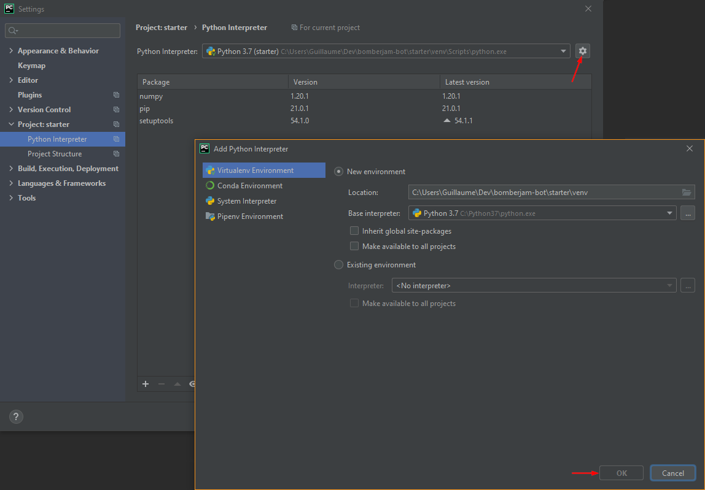
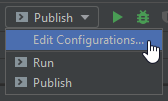
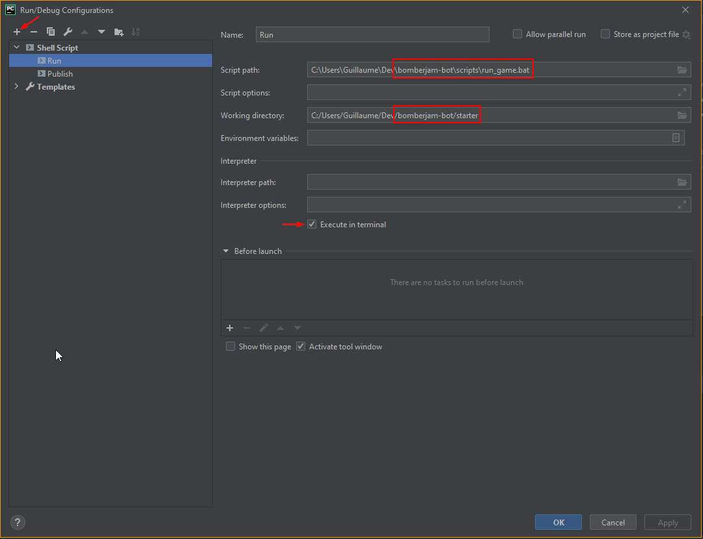
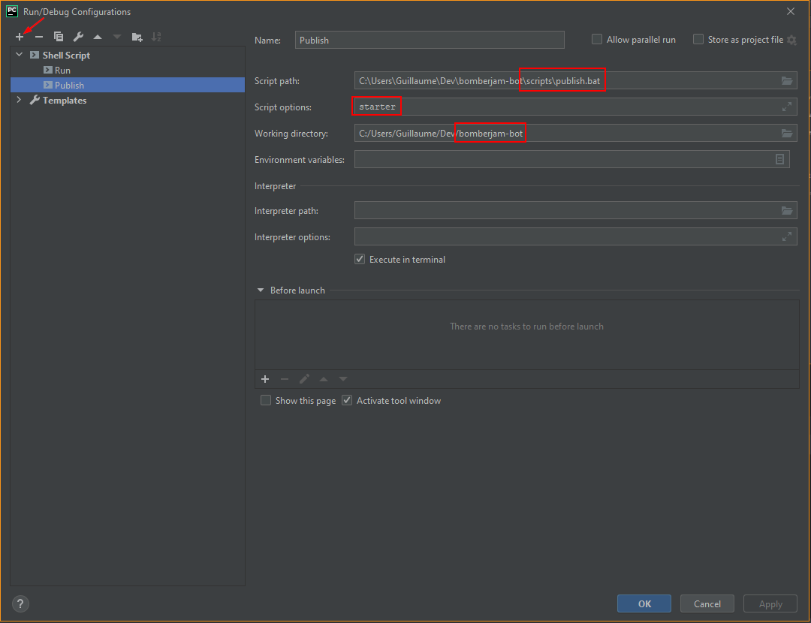

Find more about Bomberjam at https://github.com/asimmon/bomberjam-contest
# Bomberjam Python Starter kit  
This starter kit is meant to be a good project structure that can be used as is. It provides everything you need to get started, including complete game state modeling, logging, an abstracted game loop and various utility scripts.  
You can, however, use it as an inspiration and set up your own project if you prefer.   

## Project Structure
The project structure looks like this:
```
bomberjam/  
├── scripts/ 
|   ├── bomberjam.exe <-- You need to copy paste this one yourself based on your OS 
│   ├── publish.bat
|   └── run_game.bat
├── starter/  
|   ├── bot_logic/  
|   |   └── bot.py <-- Code your logic here
|   ├── core/  
|   ├── models/ <-- Game state models  
|   ├── install.sh <-- Invoked by the game server  
|   ├── MyBot.py <-- Abstracted game loop, DO NOT RENAME  
|   ├── README  
|   └── requirements.txt  
└── README
```
The `starter` folder is your bot folder.  
If you use the starter kit as is, you will most likely only work inside `bot_logic/`  
When you'll want to publish your bot, you will have to zip the `starter` folder.  
Because of the way publishing works, if you want to develop multiple bots, make them play locally against each other and still be able to publish them individually, it will be easier if you have one folder per bot.  

## Running your bot locally
Before running your bot, you will have to create a virtualenv inside your bot folder and activate it.
Then, still from your bot folder, run the `run_game.bat` script that you can find in the root folder scripts. Make sure to have copied the right `bomberjam.exe` there based on your OS otherwise the script won't work.
A game will start where each player is your bot.  

#### Example usage:
```
bomberjam\starter> ..\scripts\run_game.bat
```

You could also run the script from the root folder. If you do so, pass as argument 1 to 4 bot folder names. The first name you pass will be the default bot. For example, if you pass 2 names, the first one will be used to run the first and last 2 bots.  
Note that you will need a virtualenv that has every requirements installed.

#### Example usage (Will run starter myBot1 starter starter):
```
bomberjam> scripts\run_game.bat starter myBot1
```

## Publishing your bot
At the root level, you will find a script folder with `publish.bat`  
This script takes the folder name of the bot you want to publish and will produce a copy of the folder, named `published/`, without the unnecessary folders like `logs/` and `venv/` (more on that later).  
The folder will be created in the working directory. Make sure you are not calling the script from inside the folder you're trying to copy.  
All you have to do then is zip the folder and upload it to Bomberjam!  
The server will look for the MyBot file, so make sure you do not rename it.  

Example usage:
```
bomberjam> scripts\publish.bat starter
```

## Suggested PyCharm setup
If you are using PyCharm, it is recommended that you open the `starter/` folder as your project.  
This will ensure that the packages structure when you develop is the same as when your code is published.  
You should then set up a virtualenv inside the folder and run `pip install`  
Finally, you can set up a Run configuration that uses `bomberjam\scripts\run_game.bat` and `bomberjam\scripts\publish.bat`   

### Setting up a virtualenv
If PyCharm does not suggest creating a virtualenv, you can do so in the interpreter settings -> add.  
Once this is done, anytime you open up a console in PyCharm, your virtualenv will already be activated.  
Make sure to `pip install`!  



### Setting up a Run configuration
In the top right corner of PyCharm, click on "Add configuration" or "Edit Configurations" if you already have one.  
  

Then, you can add 2 shell script configurations for Run and Publish.  

